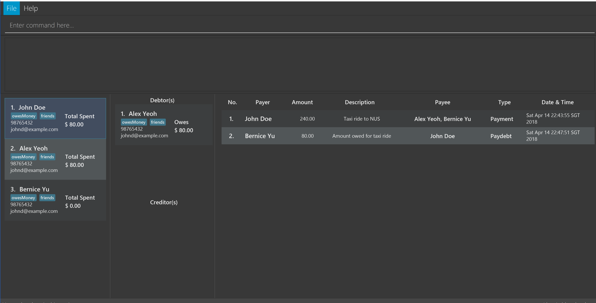

= SmartSplit
ifdef::env-github,env-browser[:relfileprefix: docs/]

https://travis-ci.org/CS2103JAN2018-W10-B1/main[image:https://travis-ci.org/CS2103JAN2018-W10-B1/main.svg?branch=master[Build Status]]
https://ci.appveyor.com/project/damithc/addressbook-level4[image:https://ci.appveyor.com/api/projects/status/3boko2x2vr5cc3w2?svg=true[Build status]]
https://coveralls.io/github/CS2103JAN2018-W10-B1/main?branch=master[image:https://coveralls.io/repos/github/CS2103JAN2018-W10-B1/main/badge.svg?branch=master[Coverage Status]]
https://www.codacy.com/app/damith/addressbook-level4?utm_source=github.com&utm_medium=referral&utm_content=se-edu/addressbook-level4&utm_campaign=Badge_Grade[image:https://api.codacy.com/project/badge/Grade/fc0b7775cf7f4fdeaf08776f3d8e364a[Codacy Badge]]
https://gitter.im/se-edu/Lobby[image:https://badges.gitter.im/se-edu/Lobby.svg[Gitter chat]]

ifdef::env-github[]

endif::[]

ifndef::env-github[]
image::images/Ui.png[width="600"]
endif::[]

* This is a desktop application for simplifying shared expenses. If you or your friends, family, peers, or partner pay for each other's expenses, you can use this application to quickly see how much each person owes.
* Why should you use it?
** Conveniently record people and transactions
** Don't do any math! SmartSplit will tell you exactly how much you have to pay each person or how much you should expect to receive from each person!
** More exciting features, such as finding transactions by keywords and forming groups, will be available in `v2.0`!

== Site Map

* <<UserGuide#, User Guide>>
* <<DeveloperGuide#, Developer Guide>>
* <<AboutUs#, About Us>>
* <<ContactUs#, Contact Us>>

== Acknowledgements

* SmartSplit is based on the AddressBook-Level4 project created by SE-EDU initiative at https://github.com/se-edu/

== Licence : link:LICENSE[MIT]
